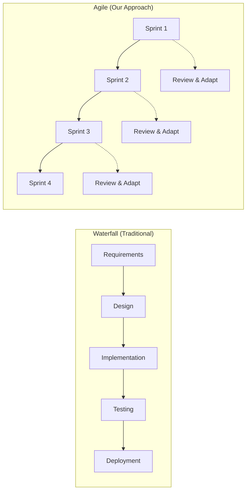
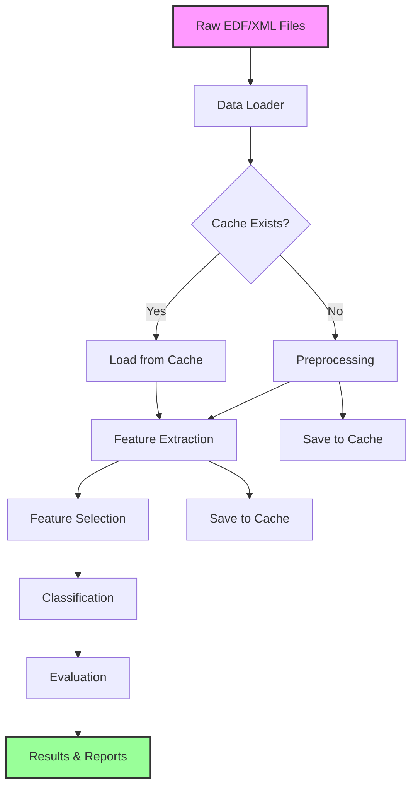
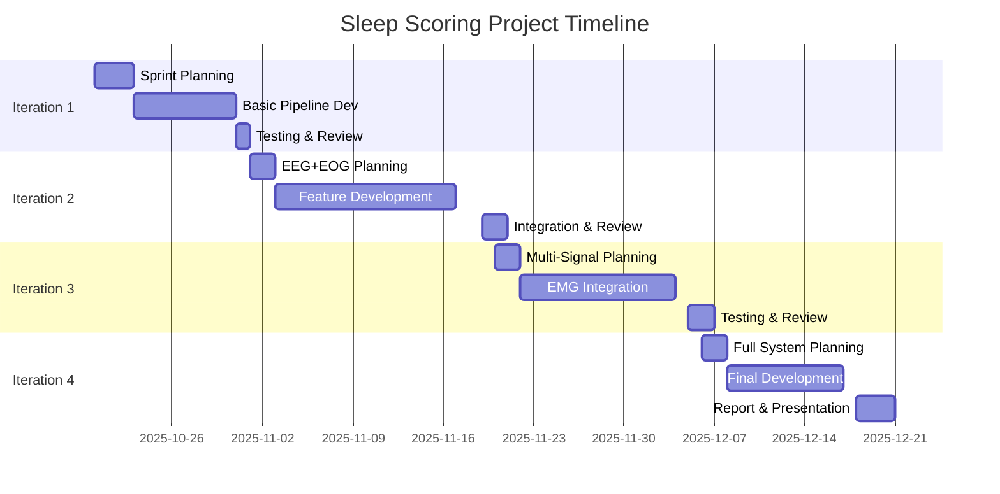
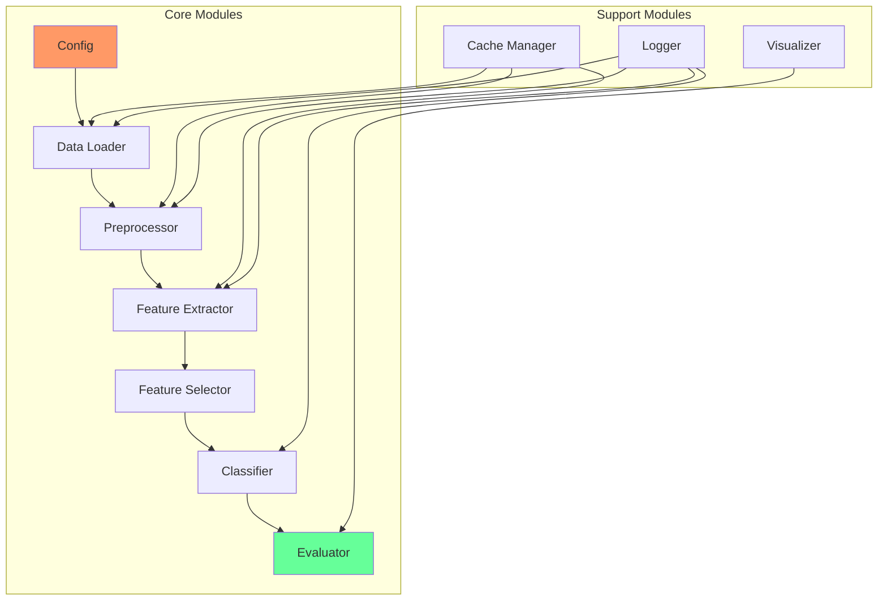

# 📚 Sleep Scoring Project - Complete Guide
## Biomedical Signal Processing (CM2013)

---

## Table of Contents
1. [Project Overview](#project-overview)
2. [Project Management Fundamentals](#project-management-fundamentals)
3. [System Architecture](#system-architecture)
4. [Team Organization](#team-organization)
5. [Development Timeline](#development-timeline)
6. [Technical Implementation](#technical-implementation)
7. [Testing & Quality Assurance](#testing--quality-assurance)
8. [Performance Tracking](#performance-tracking)
9. [Deliverables](#deliverables)
10. [Glossary](#glossary)
11. [ClickUp Guide](#clickup-guide)

---

## 📋 Project Overview

### Goal
Develop an automatic sleep scoring system using multi-signal biosignal processing with iterative improvements over 10 weeks.

### Key Metrics
| Metric | Target | Weight |
|--------|--------|--------|
| Methodology and Code Quality | Modular design, correct pipeline, documentation, testing | 50% |
| Team Collaboration | Regular updates, integration, ClickUp usage | 30% |
| Report & Documentation | Clear technical writing, comprehensive analysis | 20% |

### Learning Objectives
- ✅ Apply signal processing techniques to real biomedical data
- ✅ Implement machine learning classifiers for pattern recognition
- ✅ Practice agile software development in a team
- ✅ Develop professional documentation skills

---

## 🚀 Project Management Fundamentals

### Agile vs. Waterfall Development



### Why Agile for This Project?

| Aspect | Waterfall ❌ | Agile ✅ |
|--------|------------|----------|
| **Feedback** | Only at end | After each iteration |
| **Risk** | High (all-or-nothing) | Low (incremental) |
| **Flexibility** | Rigid plan | Adapt based on results |
| **Testing** | Late discovery of issues | Early problem detection |
| **Learning** | Limited until end | Continuous improvement |

### Sprint Structure

Each sprint (iteration) follows this pattern:

```
┌─────────────────────────────────────────┐
│         SPRINT LIFECYCLE (2.5 weeks)     │
├─────────────────────────────────────────┤
│ Day 1-2:    Sprint Planning              │
│             • Define goals               │
│             • Assign tasks               │
│             • Update ClickUp             │
├─────────────────────────────────────────┤
│ Day 3-15:   Development                  │
│             • Daily standups             │
│             • Code implementation        │
│             • Continuous integration     │
├─────────────────────────────────────────┤
│ Day 16-17:  Testing & Integration        │
│             • Run full pipeline          │
│             • Fix bugs                   │
│             • Performance evaluation     │
├─────────────────────────────────────────┤
│ Day 18:     Sprint Review                │
│             • Demo to team               │
│             • Document results           │
│             • Plan next sprint           │
└─────────────────────────────────────────┘
```

---

## 🏗️ System Architecture

### High-Level Architecture

```
┌──────────────────────────────────────────────────┐
│                   DATA LAYER                      │
│  ┌──────────┐  ┌──────────┐  ┌──────────┐      │
│  │ EDF Files│  │XML Files │  │  Cache   │      │
│  └──────────┘  └──────────┘  └──────────┘      │
└────────────────────┬─────────────────────────────┘
                     │
┌────────────────────▼─────────────────────────────┐
│               PROCESSING LAYER                    │
│  ┌─────────────┐  ┌──────────────┐              │
│  │Data Loading │  │ Preprocessing│              │
│  └─────────────┘  └──────────────┘              │
│  ┌─────────────┐  ┌──────────────┐              │
│  │  Features   │  │  Selection   │              │
│  └─────────────┘  └──────────────┘              │
└────────────────────┬─────────────────────────────┘
                     │
┌────────────────────▼─────────────────────────────┐
│              INTELLIGENCE LAYER                   │
│  ┌─────────────┐  ┌──────────────┐              │
│  │ Classifiers │  │  Evaluation  │              │
│  └─────────────┘  └──────────────┘              │
└────────────────────┬─────────────────────────────┘
                     │
┌────────────────────▼─────────────────────────────┐
│               PRESENTATION LAYER                  │
│  ┌─────────────┐  ┌──────────────┐              │
│  │   Results   │  │Visualization │              │
│  └─────────────┘  └──────────────┘              │
└───────────────────────────────────────────────────┘
```

### Modular Design Pattern

Each module follows this interface:

```python
# Standard Module Interface
def module_function(input_data, parameters):
    """
    Purpose: Clear description of what module does
    
    Inputs:
        input_data: Type and format specification
        parameters: Configuration dictionary
    
    Outputs:
        output_data: Type and format specification
    
    Example:
        result = module_function(data, {'param1': value})
    """
    # Validate inputs
    # Process data
    # Return outputs
```

### Data Flow Diagram



---

## 👥 Team Organization

### Role Distribution (4-Person Team)

| Role | Primary Responsibilities | Secondary Tasks | ClickUp Tags |
|------|-------------------------|-----------------|--------------|
| **Project Manager** | • Team coordination<br>• ClickUp management<br>• Integration testing<br>• Documentation | • Code reviews<br>• Meeting facilitation | `#management` `#integration` |
| **Preprocessing Lead** | • Signal cleaning<br>• Artifact removal<br>• Filter design<br>• Data validation | • Cache optimization<br>• Performance testing | `#preprocessing` `#filters` |
| **Feature Engineer** | • Feature extraction<br>• Feature selection<br>• Statistical analysis<br>• Feature documentation | • Visualization<br>• Feature importance | `#features` `#analysis` |
| **ML Engineer** | • Classifier implementation<br>• Hyperparameter tuning<br>• Cross-validation<br>• Model evaluation | • Results reporting<br>• Confusion matrices | `#ml` `#classification` |

### Communication Matrix

| Communication Type | Frequency | Platform | Duration | Participants |
|-------------------|-----------|----------|----------|--------------|
| Daily Standup | Daily | ClickUp Comments | 5 min | All |
| Sprint Planning | Per Sprint | Video Call | 1 hour | All |
| Code Review | 2x/week | GitHub PR | 30 min | Pairs |
| Integration Test | Weekly | In-person/Video | 1 hour | All |
| Sprint Review | Per Sprint | Video Call | 30 min | All + Instructor |

---

## 📅 Development Timeline

### 10-Week Sprint Schedule



### Iteration Details Table

| Iteration | Sprint Deadline | Focus | Signals | Features | Classifier | Risk Level |
|-----------|----------------|-------|---------|----------|------------|------------|
| **1** | Oct 31, 2025 | Basic Pipeline | EEG | Time (16) | k-NN | Low |
| **2** | Nov 19, 2025 | Enhanced Processing | EEG+EOG | Time+Freq (31) | SVM | Low |
| **3** | Dec 5, 2025 | Multi-Signal | EEG+EOG+EMG | Selected (30) | RF | Medium |
| **4** | Dec 18, 2025 | Full System | All | Optimized | RF-opt | High |

---

## 💻 Technical Implementation

### Module Dependency Graph



### Feature Extraction Pipeline

| Domain | Feature Count | Examples | Computation Time |
|--------|--------------|----------|------------------|
| **Time** | 16 per channel | Mean, Variance, Hjorth | Fast (< 1s) |
| **Frequency** | 15 per channel | Band powers, Spectral entropy | Medium (2-3s) |
| **Time-Frequency** | 20 per channel | Wavelet coefficients | Slow (5-10s) |

### Classification Algorithms Comparison

| Algorithm | Iteration | Pros | Cons | Hyperparameters |
|-----------|-----------|------|------|-----------------|
| **k-NN** | 1 | • Simple<br>• No training<br>• Good baseline | • Slow prediction<br>• Memory intensive | k (neighbors) |
| **SVM** | 2 | • Good accuracy<br>• Works with high-dim data | • Slow training<br>• Needs tuning | C, kernel, gamma |
| **Random Forest** | 3-4 | • High accuracy<br>• Feature importance<br>• Robust | • Can overfit<br>• Many parameters | n_trees, max_depth |

---

## 🧪 Testing & Quality Assurance

### Testing Strategy

| Test Type | Frequency | Responsibility | Tools |
|-----------|-----------|----------------|-------|
| **Unit Tests** | Per commit | Module owner | MATLAB/pytest |
| **Integration Tests** | Daily | PM | Full pipeline |
| **Performance Tests** | Per iteration | Team | Confusion matrix |
| **Regression Tests** | Per sprint | All | Previous results |

### Code Quality Checklist

- [ ] **Documentation**
  - [ ] Function headers complete
  - [ ] Input/output specs clear
  - [ ] Examples provided
  
- [ ] **Error Handling**
  - [ ] Input validation
  - [ ] Try-catch blocks
  - [ ] Meaningful error messages
  
- [ ] **Performance**
  - [ ] Vectorized operations
  - [ ] Efficient algorithms
  - [ ] Memory management
  
- [ ] **Style**
  - [ ] Consistent naming
  - [ ] Proper indentation
  - [ ] Comments for complex logic

---

## 📊 Performance Tracking

### Iteration Performance Dashboard

| Metric | Iter 1 | Iter 2 | Iter 3 | Iter 4 |
|--------|--------|--------|--------|--------|
| **Overall Accuracy** | ___% | ___% | ___% | ___% |
| **Kappa Score** | ___ | ___ | ___ | ___ |
| **F1 Score (Macro)** | ___ | ___ | ___ | ___ |
| **Processing Time** | ___s | ___s | ___s | ___s |
| **Features Used** | ___ | ___ | ___ | ___ |

### Per-Stage Accuracy Tracking

| Sleep Stage | Baseline | Iter 1 | Iter 2 | Iter 3 | Iter 4 |
|-------------|----------|--------|--------|--------|--------|
| **Wake** | Random: 20% | ___% | ___% | ___% | ___% |
| **N1** | Random: 20% | ___% | ___% | ___% | ___% |
| **N2** | Random: 20% | ___% | ___% | ___% | ___% |
| **N3** | Random: 20% | ___% | ___% | ___% | ___% |
| **REM** | Random: 20% | ___% | ___% | ___% | ___% |

---

## 📦 Deliverables

### Final Submission Checklist

#### Code Repository
- [ ] Complete source code (MATLAB/Python)
- [ ] README with setup instructions
- [ ] Requirements/dependencies documented
- [ ] Example data files
- [ ] Unit tests

#### Documentation
- [ ] Technical report (15 pages max)
- [ ] API documentation
- [ ] User guide
- [ ] Performance analysis

#### Report Structure (15 pages)
1. **Introduction** (1 page)
   - Problem statement
   - Objectives
   
2. **Methods** (3 pages)
   - Signal processing
   - Feature extraction
   - Classification approach
   
3. **Results** (4-5 pages)
   - Performance metrics
   - Confusion matrices
   - Statistical analysis
   
4. **Discussion** (3-4 pages)
   - Interpretation
   - Challenges faced
   - Improvements made
   
5. **Conclusion** (1 page)
   - Summary
   - Future work
   
6. **References** (1 page)

---

## 📖 Glossary

### Project Management Terms

| Term | Definition | Example in Project |
|------|------------|-------------------|
| **Agile** | Iterative development methodology with regular feedback | 4 iterations over 10 weeks |
| **Sprint** | Fixed time period for development cycle | 2.5 weeks per iteration |
| **Standup** | Brief daily status meeting | 5-min ClickUp updates |
| **User Story** | Feature from user's perspective | "As a clinician, I need 75% accuracy" |
| **Backlog** | List of pending tasks | ClickUp "To Do" list |
| **Sprint Planning** | Meeting to define sprint goals | Day 1 of each iteration |
| **Sprint Review** | Meeting to demo results | End of each iteration |
| **Burndown Chart** | Progress visualization | Tasks completed vs. time |
| **Velocity** | Team's completion rate | Features per sprint |
| **MVP** | Minimum Viable Product | Iteration 1 pipeline |

### Technical Terms

| Term | Definition | Relevance |
|------|------------|-----------|
| **EEG** | Electroencephalogram - brain activity | Primary signal for sleep (C3-A2, C4-A1 at 125 Hz) |
| **EOG** | Electrooculogram - eye movements | Detects REM sleep (Left/Right at 50 Hz) |
| **EMG** | Electromyogram - muscle activity | Muscle tone indicator (125 Hz) |
| **ECG** | Electrocardiogram - heart electrical activity | Heart rate variability (125 Hz) |
| **Epoch** | Fixed time segment | 30-second windows |
| **Artifact** | Unwanted signal noise | Must be removed |
| **Bandpass Filter** | Frequency range filter | 0.15-40 Hz for EEG (hardware high-pass 0.15 Hz) |
| **Notch Filter** | Removes specific frequency | 50 Hz powerline |
| **PSD** | Power Spectral Density | Frequency analysis |
| **Hjorth Parameters** | Time-domain EEG features | Activity, mobility, complexity |
| **Kappa Score** | Agreement measure | Accounts for chance |
| **F1 Score** | Harmonic mean metric | Precision-recall balance |
| **Cross-validation** | Model validation technique | Prevents overfitting |

### ClickUp Terms

| Term | Definition | How to Use |
|------|------------|------------|
| **Space** | Top-level container | "CM2013 Project" |
| **List** | Task grouping | "Iteration 1", "Iteration 2" |
| **Task** | Single work item | "Implement bandpass filter" |
| **Subtask** | Task component | "Test on channel 1" |
| **Custom Field** | Additional task info | Priority, Signal Type |
| **Tag** | Task label | #preprocessing, #bug |
| **Assignee** | Task owner | Team member name |
| **Due Date** | Task deadline | Within sprint dates |
| **Status** | Task progress | To Do → In Progress → Done |
| **Comment** | Task discussion | Questions, updates |
| **@Mention** | Notify teammate | @john need help here |

---

## 📊 Available Signals and Data Format

### Signal Information

The EDF files contain multiple physiological signals recorded at different sampling rates:

| Channel | EDF Label | Input 1 | Input 2 | Sampling Rate (Hz) | Hardware Filters (Hz) | Sensor Type |
|---------|-----------|---------|---------|-------------------|----------------------|-------------|
| **Linked EEG** | EEG (sec) | C3 | A2 | 125 | High pass 0.15 | Gold cup electrode |
| **Linked EEG** | EEG | C4 | A1 | 125 | High pass 0.15 | Gold cup electrode |
| **Left EOG** | EOG(L) | EOG(L) | PG1 | 50 | High pass 0.15 | Gold cup electrode |
| **Right EOG** | EOG(R) | EOG(R) | PG1 | 50 | High pass 0.15 | Gold cup electrode |
| **EMG** | EMG | EMG | - | 125 | High pass 0.15 | Gold cup electrode |
| **ECG** | ECG | ECG | - | 125 | High pass 0.15 | Ag/AgCl patch |
| **Thorax** | Thor RES | Thor RES | - | 10 | High pass 0.05 | Respitrace Inductance Plethysmography |
| **Abdomen** | Abdo RES | Abdo RES | - | 10 | High pass 0.05 | Respitrace Inductance Plethysmography |
| **Airflow** | New Air | New Air | - | 10 | High pass 0.05 | ProTech thermistor M325 |
| **Airflow (alt)** | Airflow | Airflow | - | 10 | High pass 0.05 | Compumedics thermistor |
| **SpO2** | SaO2 | SaO2 | - | 1 | - | Nonin XPOD 3011, 8000 sensor |
| **Heart Rate** | H.R. | H.R. | - | 1 | - | Nonin XPOD 3011, 8000 sensor |
| **Position** | Position | Position | - | 1 | High pass 0.05 | Internal mercury gauge |
| **Light** | Light | Light | - | 1 | - | External ambient light sensor |
| **Oximetry Status** | OX STAT | OX STAT | - | 1 | - | Nonin XPOD 3011, 8000 sensor |

### Key Signals for Sleep Scoring

**Primary Signals (Most Important):**
- **EEG (C3-A2, C4-A1)**: Brain activity patterns, primary for sleep stage classification (125 Hz)
- **EOG (Left/Right)**: Eye movements, essential for detecting REM sleep (50 Hz)
- **EMG**: Muscle tone indicator for sleep stages (125 Hz)

**Secondary Signals (Complementary Information):**
- **ECG**: Heart rate variability analysis (125 Hz)
- **Respiration (Thorax/Abdomen)**: Breathing patterns (10 Hz)
- **SpO2 & Heart Rate**: Oxygen saturation and pulse (1 Hz)
- **Airflow**: Breathing flow detection (10 Hz)

### Important Notes on Signal Processing

**Hardware Filtering:**
- EEG, EOG, EMG, ECG signals have hardware high-pass filter at **0.15 Hz**
- Respiration signals have hardware high-pass filter at **0.05 Hz**
- Consider these when designing additional filtering stages

**Sampling Rate Considerations:**
- Different signals have different sampling rates (1-125 Hz)
- You may need to resample or process at native rates
- 30-second epochs translate to different numbers of samples per signal

**Data Format:**
- EDF format stores all signals with metadata
- XML files contain sleep stage annotations (30-second epochs)
- Sleep stages: Wake, N1, N2, N3, REM

**Dataset Overview:**
- **Training set:** 10 labeled recordings (R1-R10) in `data/training/`
  - Each has both .edf (signals) and .xml (labels) files
  - Use all 10 for training and validation with cross-validation
  - Total: ~10,800 labeled epochs
- **Holdout set:** 10 unlabeled recordings in `data/holdout/`
  - Only .edf files (no labels)
  - For final competition submission
  - Your model will predict labels for these recordings

---

## 🎯 Success Tips

### For Project Managers
1. **Daily Check**: Review all task statuses
2. **Weekly Report**: Summarize progress
3. **Risk Management**: Identify blockers early
4. **Communication**: Over-communicate is better

### For Developers
1. **Code First**: Get something working
2. **Optimize Later**: Don't perfectonize early
3. **Test Often**: Run pipeline after changes
4. **Document Now**: Not later

### For Teams
1. **Help Each Other**: Share knowledge
2. **Celebrate Wins**: Acknowledge progress
3. **Learn from Failures**: Document what didn't work
4. **Stay Flexible**: Adapt based on results

---

## 📞 Getting Help

### Priority Support Channels

1. **Technical Issues**
   - Check documentation first
   - Ask teammate
   - Post in course forum
   - Contact instructor

2. **Team Issues**
   - Direct conversation
   - PM mediation
   - Instructor intervention

3. **Conceptual Questions**
   - Review lecture materials
   - Consult research papers
   - Office hours

---

## 🏁 Final Checklist

### Week 10 Submission

- [ ] Code repository complete and documented
- [ ] All 4 iterations implemented
- [ ] Performance metrics recorded
- [ ] 15-page report finalized
- [ ] Presentation prepared
- [ ] Individual contributions documented
- [ ] ClickUp project archived
- [ ] Lessons learned documented

---

*Remember: The journey is as important as the destination. Focus on learning, collaboration, and incremental improvement rather than perfect results.*

**Good luck with your project! 🚀**

---

## 🎯 Getting Started & Implementation Guide

### First Steps: Setting Up Your Environment

#### 1. Clone and Verify the Jumpstart Code

```bash
# Navigate to your project directory
cd CM2013/Python  # or MATLAB

# Python: Install dependencies
pip install -r requirements.txt

# Verify installation by running tests
python -m pytest tests/ -v

# Expected output: All 13 tests should PASS
```

#### 2. Understanding the Jumpstart Structure

**What's PROVIDED (Examples Only):**
- ✅ Basic project structure and configuration system
- ✅ Simple lowpass filter example (40Hz cutoff)
- ✅ 3 basic statistical features (mean, median, std)
- ✅ Basic k-NN classifier with simple train/test split
- ✅ Dummy data loading for testing
- ✅ Cache management system

**What YOU Must IMPLEMENT:**
- ❌ Real EDF/XML file loading (currently uses dummy data)
- ❌ Proper preprocessing (baseline removal, artifact rejection)
- ❌ Spectral estimation (AR, Welch, Wavelet)
- ❌ Comprehensive feature extraction (16+ features for Iteration 1)
- ❌ Feature selection algorithms
- ❌ Advanced classifiers (SVM, Random Forest)
- ❌ Cross-validation and hyperparameter tuning

#### 3. Quick Test Run (Verify Everything Works)

```bash
# Python
cd Python
python main.py

# MATLAB
cd MATLAB
main

# This should complete without errors (using dummy data)
# You'll see: "WARNING: Using dummy data! Students must implement actual EDF/XML loading."
```

---

### 📖 Step-by-Step Implementation Roadmap

## ITERATION 1: Basic EEG Pipeline (Weeks 1-3)

### Phase 1: Data Loading (Week 1, Days 1-2)

**Goal:** Load real EDF files and XML annotations from **all available training records**

**Files to modify:**
- `Python/src/data_loader.py` (lines 15-85)
- `MATLAB/src/load_training_data.m`

**CRITICAL: Use All Training Data**

⚠️ **You must load and use ALL available training recordings, not just one!**

Your `data/training/` directory contains **10 labeled recordings** (R1-R10, each with .edf and .xml files). Each recording is a full-night sleep study (~9 hours, ~1080 epochs per subject).

Additionally, `data/holdout/` contains **10 unlabeled recordings** for final competition submission (no XML annotations).

**Why use all 10 training recordings?**
- **Better generalization:** Models trained on single subjects overfit to that individual
- **More training data:** 10 subjects × ~1080 epochs = ~10,800 total training epochs
- **Subject variability:** Different sleep patterns, ages, conditions, signal quality
- **Robust features:** Features that work across subjects are truly discriminative
- **Proper cross-validation:** With 10 subjects, you can do rigorous k-fold cross-validation (e.g., 5-fold or 10-fold leave-subjects-out)

**Implementation approach:**
1. Create a function that loads a single recording (EDF + XML pair)
2. Loop through all `.edf` files in `data/training/` directory
3. Load each recording and concatenate epochs
4. Keep track of recording IDs for later analysis
5. Shuffle combined data before train/test split (maintain independence)

**Example structure:**
```python
def load_all_training_data(training_dir):
    all_epochs = []
    all_labels = []
    all_record_ids = []

    # Find all EDF files in training directory
    edf_files = glob(os.path.join(training_dir, '*.edf'))

    for edf_path in edf_files:
        xml_path = edf_path.replace('.edf', '.xml')
        # Load single recording
        epochs, labels = load_single_recording(edf_path, xml_path)

        all_epochs.append(epochs)
        all_labels.append(labels)
        # Track which recording each epoch came from
        record_id = os.path.basename(edf_path).replace('.edf', '')
        all_record_ids.extend([record_id] * len(labels))

    # Concatenate all recordings
    combined_epochs = np.concatenate(all_epochs, axis=0)
    combined_labels = np.concatenate(all_labels, axis=0)

    return combined_epochs, combined_labels, all_record_ids
```

**What to implement:**

#### 1. Single Recording EDF Loading

**Recommended library:** MNE-Python (already in requirements.txt) or pyedflib

**Key steps:**
- Use `mne.io.read_raw_edf()` to load EDF file
- Extract channel names and identify EEG channels (look for 'EEG' in channel name)
- For iteration 1, select only EEG channels using `pick_channels()`
- Get sampling frequency from file metadata
- Extract raw data as numpy array

**Expected output format (per recording):**
- Data: `(n_channels, n_samples)` - continuous signal
- Sampling frequency: typically 125 Hz for EEG
- Channel names: list of strings

**Validation:** Print channel names and verify you have 2 EEG channels

#### 2. XML Annotation Loading

**XML structure (Compumedics format):**
```xml
<ScoredEvent>
    <EventConcept>SDO:NonRapidEyeMovementSleep-N2</EventConcept>
    <Start>60.0</Start>  <!-- seconds -->
    <Duration>30.0</Duration>
</ScoredEvent>
```

**Key steps:**
- Use `xml.etree.ElementTree` to parse XML
- Find all `<ScoredEvent>` elements
- Extract `<EventConcept>` and map to numeric labels:
  - Wake: 0
  - N1: 1
  - N2: 2
  - N3/N4: 3
  - REM: 4
- Extract `<Start>` time for each event
- **Important:** Skip non-sleep-stage events (e.g., arousals, apneas)

**Expected output:** Array of labels corresponding to 30-second epochs

**Validation:** Check label distribution - N2 should be most common (40-50%)

#### 3. Epoch Segmentation

**Algorithm:**
1. Calculate samples per epoch: `samples = fs * 30`
2. Calculate number of complete epochs
3. Truncate signal to exact multiple of epoch length
4. Reshape data array to `(n_epochs, n_channels, samples_per_epoch)`

**Validation:** Verify epochs array shape matches labels array length

---

### Phase 2: Preprocessing (Week 1-2, Days 3-7)

**Goal:** Remove artifacts and noise from EEG signals

**Files to modify:**
- `Python/src/preprocessing.py` (replace stub functions)
- `MATLAB/src/preprocess_signal.m`

#### A. Baseline Wander Removal

**Problem:** Low-frequency drift from electrode impedance, respiration, movement

**Solution:** High-pass filter

**Literature to study:**
- Rechtschaffen & Kales (1968) - Manual of Standardized Terminology
- AASM Manual for Scoring of Sleep and Associated Events (2007+)
- Research papers on EEG preprocessing for sleep analysis

**Key questions to answer from literature:**
- What cutoff frequency removes baseline drift without affecting delta waves?
- What filter order provides good attenuation without excessive phase distortion?
- Why is zero-phase filtering (filtfilt) preferred over standard filtering?
- What are typical baseline drift frequencies in sleep EEG recordings?

**Implementation approach:**
1. Design Butterworth high-pass filter using `scipy.signal.butter()`
2. Apply with `filtfilt()` for zero-phase filtering
3. Normalize cutoff by Nyquist frequency (fs/2)

**Validation checklist:**
- [ ] Plot original vs filtered signal - drift should be removed
- [ ] Check signal mean ≈ 0
- [ ] Verify no phase shift (compare peaks before/after)
- [ ] Ensure delta band (low-frequency sleep waves) is not attenuated

#### B. Powerline Interference Removal

**Problem:** 50 Hz (Europe) or 60 Hz (US) noise from electrical equipment

**Solution:** Notch filter at powerline frequency + harmonics

**Literature to study:**
- Research appropriate Q-factor for notch filters in biomedical signals
- Consider applying at fundamental frequency and harmonics
- Reference: IEEE standards for biomedical signal processing

**Key questions to answer from literature:**
- What Q-factor range provides narrow enough notch without affecting neighboring frequencies?
- Should you apply notch at harmonics (e.g., 100 Hz, 150 Hz)? Why?
- What are the trade-offs between IIR and FIR notch filters?

**Implementation approach:**
1. Use `scipy.signal.iirnotch()` to design notch filter
2. Apply at fundamental frequency and relevant harmonics
3. Check Nyquist limit: filter frequency must be < fs/2

**Validation:** Plot power spectrum before/after - should see dip at notch frequencies

#### C. Bandpass Filtering for Sleep EEG

**Sleep EEG frequency bands (AASM Manual, 2007):**
- **Delta:** Deep sleep (N3)
- **Theta:** Light sleep (N1), REM
- **Alpha:** Awake relaxed, drowsiness
- **Sigma:** Sleep spindles (N2 marker)
- **Beta:** Alert waking, REM
- **Gamma:** Typically noise in sleep recordings

**Literature to study:**
- AASM Manual for specific frequency ranges of each band
- Research on optimal bandpass ranges for sleep EEG analysis
- Studies comparing different preprocessing pipelines

**Key questions to answer from literature:**
- What are the exact frequency boundaries for each sleep band?
- What low and high cutoff frequencies preserve all relevant sleep information?
- Why is high-frequency content (>40 Hz) typically considered noise in sleep EEG?
- What filter order balances frequency selectivity with phase distortion?

**Implementation approach:**
1. Use Butterworth bandpass filter
2. Define low and high cutoffs based on literature findings
3. Apply zero-phase filtering with filtfilt()

**Iteration 1 preprocessing pipeline:**
1. Baseline removal (high-pass at appropriate cutoff)
2. Powerline noise removal (notch at fundamental + harmonics)
3. Bandpass filter (preserve relevant frequency range)

**Note:** Consider the order of operations - why might baseline removal before notch filtering be beneficial?

**Validation:** Use `plot_sample_epoch()` to visualize before/after preprocessing

---

### Critical Preprocessing Decisions: Whole Signal vs. Per-Epoch

**Question:** Should you preprocess the entire recording continuously, or process each epoch separately?

#### Strategy A: Preprocess Entire Signal, Then Segment

**Approach:**
1. Load full EDF file (all ~9 hours)
2. Apply all filters to continuous signal
3. Segment into 30-second epochs
4. Extract features from each epoch

**Advantages:**
- Filters see longer context
- No edge effects between epochs
- Maintains signal continuity

**Disadvantages:**
- High memory usage for long recordings
- Must handle entire signal at once

#### Strategy B: Segment First, Then Preprocess Each Epoch

**Approach:**
1. Load full EDF file
2. Segment into 30-second epochs
3. Apply filters to each epoch independently
4. Extract features

**Advantages:**
- Lower memory footprint
- Easier to parallelize
- Can process epochs independently

**Disadvantages:**
- **Edge effects!** Filter transients at epoch boundaries
- Loss of inter-epoch continuity
- May distort signal at boundaries

#### Critical Considerations

**Edge Effects and Transient Response:**
- Filters need "warm-up" time to reach steady state
- Short epochs (30 seconds) may have significant edge distortion
- `filtfilt()` helps (processes forward and backward) but doesn't eliminate edges

**Literature to study:**
- Papers on edge effect mitigation in EEG processing
- Zero-padding techniques before filtering
- Overlap-and-add methods for segmented processing

**Key questions to answer:**
- How many samples at epoch edges are affected by filter transients?
- Does `filtfilt()` completely eliminate edge effects?
- Should you pad epochs before filtering? If so, with what (zeros, reflection, wrap)?
- What percentage of your 30-second epoch is affected by edge artifacts?
- Do edge effects matter for feature extraction?

**Recommended approach for investigation:**
1. Implement both strategies
2. Compare filtered signals visually
3. Plot first/last 1 second of each epoch
4. Measure edge distortion quantitatively
5. Test if feature values differ significantly
6. Document your choice with justification

---

### Zero-Padding and Boundary Handling

**Problem:** Filtering short segments can introduce artifacts at boundaries

**Questions to explore:**

1. **Should you zero-pad before filtering?**
   - Adds samples at boundaries to reduce edge effects
   - But introduces discontinuity (sudden jump to zero)
   - Literature: Compare zero-padding vs. no padding

2. **Alternative padding methods:**
   - **Reflection padding:** Mirror signal at edges
   - **Wrap padding:** Treat signal as circular
   - **Symmetric padding:** Extend with even/odd reflection
   - Which is most appropriate for EEG signals?

3. **How much padding?**
   - Related to filter order and cutoff frequency
   - Rule of thumb: 3-5 times filter order?
   - Literature: Optimal padding length for biomedical signals

4. **scipy.signal.filtfilt padding parameter:**
   - `padtype='odd'`, `'even'`, `'constant'`, or None
   - `padlen`: length of padding
   - What do these options do? Test and document!

**Implementation considerations:**
```python
# Example structure - students must research parameters
from scipy.signal import filtfilt, butter

b, a = butter(order=?, freq=?, btype='band', fs=fs)

# Option 1: No padding
filtered = filtfilt(b, a, signal)

# Option 2: With padding (research padtype and padlen!)
filtered = filtfilt(b, a, signal, padtype=?, padlen=?)

# Question: Plot and compare results at signal edges!
```

---

## Phase 3: Feature Extraction (Week 2, Days 8-12)

**Goal:** Extract 16+ time-domain features per EEG channel (Iteration 1)

**Files to modify:**
- `Python/src/feature_extraction.py`
- `MATLAB/src/extract_features.m`

### Iteration 1 Features: Time-Domain Statistics (Target: 16 features)

**Literature basis:** Ebrahimi et al. (2008), Fraiwan et al. (2012)

#### Feature Categories

**1. Statistical Moments (6 features)**
- Mean, median, standard deviation
- Variance, skewness, kurtosis
- Use: `np.mean()`, `np.std()`, `scipy.stats.skew()`, `scipy.stats.kurtosis()`

**2. Amplitude Features (4 features)**
- Maximum, minimum, peak-to-peak range
- RMS (root mean square)
- Formula: RMS = sqrt(mean(signal²))

**3. Hjorth Parameters (3 features) - CRITICAL for sleep EEG**
- **Activity:** Variance of signal (represents power)
- **Mobility:** sqrt(var(derivative) / var(signal)) - represents mean frequency
- **Complexity:** mobility_of_derivative / mobility - represents bandwidth
- Implementation: Calculate first and second derivatives using `np.diff()`

**4. Frequency-Related (2 features)**
- **Zero-crossing rate:** Count sign changes / total samples
  - Indicates dominant frequency (more crossings = higher frequency)
- **Energy:** Sum of squared signal values

**5. Complexity Measure (1 feature)**
- **Sample Entropy:** Measures signal irregularity
  - Parameters: m=2 (pattern length), r=0.2*std (tolerance)
  - Reference: Richman & Moorman (2000)
  - Higher entropy = more complex/irregular signal

**Expected output:**
- For 2 EEG channels: 16 features × 2 channels = 32 features per epoch
- Shape: `(n_epochs, 32)`

**Validation:**
- Check for NaN or Inf values
- Verify feature values are in reasonable ranges
- Plot feature distributions across sleep stages

---

## Phase 4: Classification (Week 2-3, Days 13-17)

**Goal:** Implement k-NN classifier with proper evaluation

**Files to modify:**
- `Python/src/classification.py`
- `MATLAB/src/train_classifier.m`

### k-NN Classifier (Iteration 1)

**Literature parameters:**
- **k (number of neighbors):** 5-7 (Ebrahimi et al., 2008)
- **Distance metric:** Euclidean (default) or Manhattan
- **Weighting:** uniform or distance-weighted

**Implementation steps:**
1. Split data: 70% training, 30% testing
   - **IMPORTANT:** Use stratified split (`stratify=labels`) to maintain class balance
   - Set `random_state=42` for reproducibility
   - **With multiple recordings:** Consider subject-independent evaluation (see below)

2. Train classifier using `sklearn.neighbors.KNeighborsClassifier`
   - Start with k=5
   - Try both uniform and distance weighting

3. Evaluate performance:
   - Overall accuracy
   - Cohen's kappa (inter-rater agreement metric)
   - Confusion matrix (per-class performance)
   - Per-class accuracy

**Subject-Independent Evaluation (Critical with 10 Training Subjects):**

With 10 labeled subjects for training/validation, proper cross-validation is essential:

**Strategy A: Mixed Subject Split (NOT RECOMMENDED - Do not use!)**
- Shuffle all epochs from all 10 recordings together
- Split randomly into train/test (70/30)
- **Problem:** Training and test sets contain epochs from the same subjects
- **Result:** Overly optimistic performance (doesn't test generalization to new subjects)
- **Issue:** Completely fails to predict how your model will perform on the 10 holdout subjects
- **Why it's wrong:** You're testing on the same people you trained on!

**Strategy B: Leave-One-Subject-Out Cross-Validation (LOSO) - RECOMMENDED**
- Hold out 1 complete recording for testing
- Train on remaining 9 recordings
- Repeat 10 times (once for each subject as test set)
- **Advantage:** Maximum data for training (9 subjects), tests generalization to completely unseen subject
- **Result:** Most realistic performance estimate - mimics predicting on holdout subjects
- **Standard in sleep research:** Most published papers use LOSO or similar subject-independent validation

**Strategy C: Subject-Wise K-Fold Cross-Validation (Alternative)**
- Split 10 subjects into k folds (e.g., 5-fold = 2 subjects per fold)
- For each fold: train on 8 subjects, validate on 2 held-out subjects
- Repeat for all folds
- **Advantage:** Faster than LOSO, still tests subject independence
- **Result:** Good estimate, but less training data per fold than LOSO

**Example for Leave-One-Subject-Out (LOSO) - Recommended Approach:**
```python
from sklearn.model_selection import LeaveOneGroupOut

# Assuming you tracked record_ids when loading data
# record_ids is array like ['R1', 'R1', ..., 'R2', 'R2', ..., 'R10', 'R10', ...]

# Create LOSO cross-validation split
logo = LeaveOneGroupOut()

loso_results = []

for fold_idx, (train_idx, test_idx) in enumerate(logo.split(features, labels, groups=record_ids)):
    X_train, X_test = features[train_idx], features[test_idx]
    y_train, y_test = labels[train_idx], labels[test_idx]

    # Which subject is held out in this fold?
    test_subject = np.unique(record_ids[test_idx])[0]
    print(f"Fold {fold_idx+1}/10: Training on 9 subjects, testing on {test_subject}")

    # Train classifier on 9 subjects
    model.fit(X_train, y_train)

    # Predict on held-out subject
    y_pred = model.predict(X_test)

    # Calculate metrics for this subject
    accuracy = accuracy_score(y_test, y_pred)
    kappa = cohen_kappa_score(y_test, y_pred)

    # Per-class F1 scores
    f1_per_class = f1_score(y_test, y_pred, average=None)
    f1_macro = f1_score(y_test, y_pred, average='macro')

    loso_results.append({
        'subject': test_subject,
        'accuracy': accuracy,
        'kappa': kappa,
        'f1_macro': f1_macro
    })

    print(f"  {test_subject}: Accuracy={accuracy:.1%}, Kappa={kappa:.3f}, F1-macro={f1_macro:.3f}")

# Report mean ± std across all 10 subjects
mean_acc = np.mean([r['accuracy'] for r in loso_results])
std_acc = np.std([r['accuracy'] for r in loso_results])
mean_kappa = np.mean([r['kappa'] for r in loso_results])
std_kappa = np.std([r['kappa'] for r in loso_results])

print("\n" + "="*60)
print(f"LOSO Cross-Validation Results (10 subjects):")
print(f"  Accuracy = {mean_acc:.1%} ± {std_acc:.1%}")
print(f"  Kappa    = {mean_kappa:.3f} ± {std_kappa:.3f}")
print("="*60)

# Show per-subject variability
print("\nPer-Subject Performance:")
for r in sorted(loso_results, key=lambda x: x['accuracy'], reverse=True):
    print(f"  {r['subject']}: {r['accuracy']:.1%} (kappa={r['kappa']:.3f})")
```

**Which strategy to use?**
- **Iteration 1:** You may start with Strategy A (simpler) to quickly verify pipeline works, but you MUST document that this is not a valid evaluation
- **Iteration 2:** Implement Strategy B (LOSO) - transition to proper subject-independent evaluation
- **Iteration 3-4:** Continue using Strategy B (LOSO) - this is the **required standard** for proper evaluation
- **Always report:**
  - Mean ± std performance across all 10 folds
  - Per-subject results (shows which subjects are hardest to predict)
  - Document that you used LOSO for subject-independent validation

**Critical:** Strategy B (LOSO) performance is your best predictor for how well you'll perform on the 10 holdout subjects in the competition!

**Expected Iteration 1 performance (with LOSO):**
- Overall accuracy: 35-55% (subject-independent with LOSO)
- Cohen's kappa: 0.25-0.45 (fair to moderate agreement)
- N2 typically highest accuracy (most common stage)
- N1 typically lowest accuracy (rare, transitional stage)
- **Note:** LOSO performance is lower than mixed-split, but is the correct realistic estimate

**Validation checklist:**
- [ ] Loaded data from all 10 training recordings (not just one or two)
- [ ] Tracked record IDs for each epoch
- [ ] Used LOSO cross-validation for evaluation (not mixed shuffle split)
- [ ] Reported mean ± std performance across all 10 folds
- [ ] Showed per-subject results (which subjects are hardest?)
- [ ] No data leakage (feature scaling/selection done within each fold)
- [ ] Confusion matrix aggregated across all LOSO folds
- [ ] Documented complete methodology in ClickUp and report

---

### Understanding Performance Metrics for Sleep Staging

Sleep staging is a **multi-class classification problem** with **imbalanced classes**. Accuracy alone is insufficient!

#### Metrics to Calculate and Report

**1. Overall Accuracy**
- Simple percentage of correct predictions
- **Limitation:** Misleading with imbalanced data
- Example: If 50% of epochs are N2, always predicting N2 gives 50% accuracy!

**2. Cohen's Kappa (κ)**
- Measures agreement beyond chance
- Range: -1 to 1 (0 = random, 1 = perfect)
- Interpretation: <0.20 (poor), 0.21-0.40 (fair), 0.41-0.60 (moderate), 0.61-0.80 (substantial), >0.81 (almost perfect)
- **Important:** Standard metric in sleep research
- Use: `sklearn.metrics.cohen_kappa_score()`

**3. Per-Class Metrics: Precision, Recall, F1-Score**

For each sleep stage (Wake, N1, N2, N3, REM), calculate:

- **Precision:** Of all epochs predicted as stage X, how many were actually stage X?
  - Formula: TP / (TP + FP)
  - High precision = few false alarms

- **Recall (Sensitivity):** Of all actual stage X epochs, how many did we detect?
  - Formula: TP / (TP + FN)
  - High recall = few missed epochs

- **F1-Score:** Harmonic mean of precision and recall
  - Formula: 2 * (Precision * Recall) / (Precision + Recall)
  - Balances precision and recall

**4. Macro vs. Micro Averaging**

**Macro-averaged F1:**
- Calculate F1 for each class, then average
- Treats all classes equally (good for imbalanced data)
- Formula: (F1_wake + F1_N1 + F1_N2 + F1_N3 + F1_REM) / 5
- Use: `sklearn.metrics.f1_score(y_true, y_pred, average='macro')`

**Micro-averaged F1:**
- Pool all TP, FP, FN across classes, then calculate F1
- Dominated by majority class
- Equivalent to accuracy for multi-class problems
- Use: `sklearn.metrics.f1_score(y_true, y_pred, average='micro')`

**Weighted F1:**
- Average F1 scores weighted by class support (number of true instances)
- Accounts for class imbalance
- Use: `sklearn.metrics.f1_score(y_true, y_pred, average='weighted')`

**Which to use?**
- Report **macro-F1** to show performance across all stages fairly
- Report **weighted-F1** to show overall performance accounting for imbalance
- Always report **per-class F1** to identify which stages are problematic

**5. Confusion Matrix**
- Shows which stages are confused with each other
- Diagonal = correct predictions
- Off-diagonal = misclassifications
- Common confusions: N1↔N2, N2↔N3, Wake↔N1
- Use: `sklearn.metrics.confusion_matrix()`

**6. Additional Metrics to Consider**

- **Specificity:** TN / (TN + FP) - useful for rare classes
- **Matthews Correlation Coefficient (MCC):** Balanced measure for imbalanced data
- **Area Under ROC Curve (AUC-ROC):** For probabilistic predictions
- **Per-class accuracy:** Diagonal of normalized confusion matrix

#### Literature on Performance Metrics

**Key questions to explore:**
- Why is accuracy insufficient for imbalanced multi-class problems?
- When should you use macro vs. weighted averaging?
- What Cohen's kappa value indicates acceptable sleep staging performance?
- How do sleep research papers typically report performance?
- What is the relationship between F1-score and Cohen's kappa?

**Recommended reading:**
- Papers on evaluation metrics for imbalanced classification
- Sleep staging papers' methods sections (how do they report performance?)
- sklearn documentation on classification metrics

#### Implementation Example Structure

```python
from sklearn.metrics import (
    accuracy_score,
    cohen_kappa_score,
    f1_score,
    precision_recall_fscore_support,
    confusion_matrix,
    classification_report
)

# After prediction
y_pred = model.predict(X_test)

# Calculate all metrics
accuracy = accuracy_score(y_test, y_pred)
kappa = cohen_kappa_score(y_test, y_pred)
macro_f1 = f1_score(y_test, y_pred, average='macro')
weighted_f1 = f1_score(y_test, y_pred, average='weighted')

# Per-class metrics
precision, recall, f1, support = precision_recall_fscore_support(y_test, y_pred)

# Detailed report
stage_names = ['Wake', 'N1', 'N2', 'N3', 'REM']
print(classification_report(y_test, y_pred, target_names=stage_names))

# Confusion matrix
cm = confusion_matrix(y_test, y_pred)
```

#### What to Report in Your Project

**Minimum required:**
- Overall accuracy
- Cohen's kappa
- Macro-averaged F1-score
- Per-class precision, recall, F1 for each sleep stage
- Confusion matrix (visualized as heatmap)

**Additional (recommended):**
- Weighted F1-score
- Per-class specificity
- Statistical comparison between iterations (t-test on kappa scores)

---

### Sleep Architecture Metrics: Clinical Validation

Beyond classification accuracy, you should validate that your predictions produce **clinically meaningful sleep architecture**.

#### Standard Sleep Architecture Metrics

Sleep clinicians and researchers use these metrics to characterize sleep quality and structure. Your classifier should produce similar values to the ground truth annotations.

**1. Sleep Onset Latency (SOL)**
- **Definition:** Time from lights out to first sleep epoch (any stage except Wake)
- **Clinical significance:** Long SOL may indicate insomnia
- **Typical values:** 10-20 minutes (healthy adults)

**2. REM Latency**
- **Definition:** Time from sleep onset to first REM epoch
- **Clinical significance:** Short REM latency may indicate narcolepsy or depression
- **Typical values:** 70-120 minutes (healthy adults)

**3. Total Sleep Time (TST)**
- **Definition:** Sum of all sleep epochs (N1 + N2 + N3 + REM)
- **Unit:** Minutes or hours
- **Typical values:** 6-8 hours (healthy adults)

**4. Sleep Efficiency (SE)**
- **Definition:** (Total Sleep Time / Time in Bed) × 100%
- **Clinical significance:** Low efficiency indicates fragmented sleep
- **Typical values:** >85% considered good

**5. Wake After Sleep Onset (WASO)**
- **Definition:** Total wake time after first sleep epoch
- **Clinical significance:** High WASO indicates sleep fragmentation
- **Typical values:** <30 minutes (healthy adults)

**6. Sleep Stage Percentages**
- **N1:** 2-5% of TST (light sleep, transitions)
- **N2:** 45-55% of TST (stable sleep, most common)
- **N3:** 13-23% of TST (deep sleep, restorative)
- **REM:** 20-25% of TST (dreaming, memory consolidation)
- **Clinical significance:** Deviations may indicate sleep disorders

**7. Number of Awakenings**
- **Definition:** Count of wake periods after sleep onset
- **Clinical significance:** Frequent awakenings indicate fragmented sleep

**8. REM Cycle Count and Duration**
- **Definition:** Number of REM periods and their timing
- **Clinical significance:** Typically 4-6 REM cycles per night, increasing in duration

#### Why Calculate These Metrics?

**Validation beyond accuracy:**
- Your classifier may have 75% accuracy but produce unrealistic sleep architecture
- Example: Predicting 50% REM sleep would be clearly wrong even with decent accuracy

**Clinical plausibility check:**
- If predicted SOL = 3 hours but ground truth = 15 minutes → investigate!
- If predicted N3 = 0% → classifier is missing deep sleep entirely

**Error pattern analysis:**
- High WASO error suggests confusion between Wake and sleep stages
- REM latency error suggests poor REM detection

#### Implementation Approach

**Calculate for both ground truth and predictions:**

```python
def calculate_sleep_metrics(labels, epoch_duration=30):
    """
    Calculate sleep architecture metrics from epoch labels.

    Args:
        labels: array of sleep stage labels (0=Wake, 1=N1, 2=N2, 3=N3, 4=REM)
        epoch_duration: seconds per epoch (default 30)

    Returns:
        metrics: dict of sleep architecture values
    """
    # Students must implement based on definitions above
    metrics = {}

    # 1. Find sleep onset (first non-wake epoch)
    # 2. Calculate SOL, REM latency, TST, WASO
    # 3. Calculate stage percentages
    # 4. Count awakenings

    return metrics

# Compare ground truth vs predictions
true_metrics = calculate_sleep_metrics(y_true)
pred_metrics = calculate_sleep_metrics(y_pred)

# Report differences
for metric_name in true_metrics:
    true_val = true_metrics[metric_name]
    pred_val = pred_metrics[metric_name]
    error = abs(pred_val - true_val)
    print(f"{metric_name}: True={true_val:.1f}, Pred={pred_val:.1f}, Error={error:.1f}")
```

#### Questions to Explore from Literature

1. **What are normal ranges for each metric?**
   - Age-dependent (children vs. adults vs. elderly)
   - Population-specific norms

2. **What is clinically significant error?**
   - ±5 minutes SOL error acceptable?
   - ±10% sleep efficiency error acceptable?
   - Literature: Clinical decision thresholds

3. **How do sleep disorders affect these metrics?**
   - Insomnia: Long SOL, low SE, high WASO
   - Sleep apnea: Fragmented sleep, frequent awakenings
   - Narcolepsy: Short REM latency

4. **How should you weight epoch-level vs. architecture-level accuracy?**
   - Perfect epoch classification → perfect architecture
   - But imperfect epochs can still yield reasonable architecture
   - Which errors matter most for clinical interpretation?

**Literature to study:**
- AASM Scoring Manual (2007+) - definitions and norms
- Ohayon et al. (2004) - "Meta-Analysis of Quantitative Sleep Parameters From Childhood to Old Age"
- Carskadon & Dement sleep textbooks - sleep architecture fundamentals
- Recent sleep staging papers - how do they validate architecture?

#### Visualization: Compare Architecture

**1. Side-by-side hypnograms:**
```
Ground Truth Hypnogram
[Wake, N1, N2, N3, REM visualization over time]

Predicted Hypnogram
[Wake, N1, N2, N3, REM visualization over time]

Visually compare:
- Sleep onset timing
- REM period distribution
- Wake fragmentation
```

**2. Stage percentage comparison:**
```
Bar chart:
           Ground Truth | Predicted
Wake:         10%       |    12%
N1:            5%       |     8%
N2:           48%       |    45%
N3:           15%       |    12%
REM:          22%       |    23%
```

**3. Metric comparison table:**
```
| Metric               | Ground Truth | Predicted | Error |
|----------------------|--------------|-----------|-------|
| Sleep Onset (min)    | 15.5         | 18.0      | 2.5   |
| REM Latency (min)    | 85.0         | 92.5      | 7.5   |
| Total Sleep Time (h) | 7.2          | 7.0       | 0.2   |
| Sleep Efficiency (%) | 88.5         | 86.0      | 2.5   |
| WASO (min)           | 25.0         | 32.5      | 7.5   |
| Awakenings (#)       | 12           | 15        | 3     |
```

**4. Bland-Altman plots:**
- For each metric, plot: (True + Pred)/2 vs. (True - Pred)
- Shows bias and agreement limits
- Common in clinical validation studies

#### Reporting in Your Project

**Minimum required:**
- Calculate all standard metrics for test set
- Report mean absolute error for each metric
- Provide one example subject with side-by-side hypnograms

**Recommended additions:**
- Correlation plots (true vs. predicted for each metric)
- Distribution plots (show metric variability across subjects)
- Statistical tests (paired t-test, Bland-Altman analysis)
- Clinical plausibility discussion (are predictions realistic?)

#### Advanced: Per-Recording Analysis

Instead of overall accuracy, analyze each recording separately:

```python
# For each test recording
for recording_id in test_recordings:
    y_true_recording = get_labels(recording_id, 'true')
    y_pred_recording = get_labels(recording_id, 'pred')

    # Classification metrics
    accuracy = accuracy_score(y_true_recording, y_pred_recording)
    kappa = cohen_kappa_score(y_true_recording, y_pred_recording)

    # Architecture metrics
    true_arch = calculate_sleep_metrics(y_true_recording)
    pred_arch = calculate_sleep_metrics(y_pred_recording)

    # Report both
    print(f"Recording {recording_id}:")
    print(f"  Accuracy: {accuracy:.1%}, Kappa: {kappa:.3f}")
    print(f"  SOL Error: {abs(true_arch['SOL'] - pred_arch['SOL']):.1f} min")
    print(f"  SE Error: {abs(true_arch['SE'] - pred_arch['SE']):.1f}%")
```

**Benefits:**
- Identifies recordings where classifier fails
- Shows variability across subjects
- More realistic assessment than aggregated metrics

---

## ITERATION 2: Spectral Features (Weeks 4-6)

### Phase 1: Spectral Estimation Methods

Add frequency-domain features using three complementary methods.

#### A. Autoregressive (AR) Model - Parametric Method

**Theory:** Models signal as linear combination of past values

**Advantages:**
- High frequency resolution for short epochs
- Smooth spectrum estimate

**Literature to study:**
- Schaltenbrand et al. (1996) - AR modeling for EEG
- Acır & Güzeliş (2004) - AR parameters for sleep staging
- Papers on model order selection (AIC, BIC criteria)
- Comparison of AR methods (Burg, Yule-Walker, Levinson-Durbin)

**Key questions to answer from literature:**
- What model order range is appropriate for 30-second sleep EEG epochs?
- How does model order affect frequency resolution vs. overfitting?
- Why is the Burg method often preferred for short biomedical signals?
- How to use Akaike Information Criterion (AIC) for model order selection?
- What is the trade-off between parametric vs. non-parametric methods?

**Features to consider extracting:**
1. Power in each frequency band
2. Relative band powers (normalized by total power)
3. Spectral edge frequency (cumulative power threshold)
4. Peak frequency (dominant oscillation)
5. Spectral entropy measures

**Implementation approach:**
1. Estimate AR coefficients from signal (explore different methods)
2. Convert coefficients to PSD (power spectral density)
3. Integrate PSD over frequency bands (defined from AASM Manual)
4. Calculate derivative features

**Library suggestion:** `spectrum.arburg()` (install: `pip install spectrum`)

#### B. Welch's Method - Non-Parametric Method

**Theory:** Averages periodograms from overlapping segments

**Advantages:**
- Reduces variance compared to single periodogram
- No model order selection needed

**Literature to study:**
- Hassan & Bhuiyan (2016) - Welch method for sleep EEG
- Original Welch (1967) paper on power spectral estimation
- Comparison studies: Welch vs. periodogram vs. multitaper methods

**Key questions to answer from literature:**
- What window length provides good frequency resolution for 30-second epochs?
- Why is overlap used, and what overlap percentage is recommended?
- How does window type (Hanning, Hamming, Blackman) affect spectrum?
- What is the bias-variance trade-off in window selection?

**Features to consider extracting:**
- Band powers (same bands as AR method)
- Relative powers
- Spectral entropy: -sum(psd_norm * log(psd_norm))
- Peak frequency
- Spectral edge frequency

**Library suggestion:** `scipy.signal.welch()`

---

### Window Functions in Spectral Analysis: Critical Choice

**Question:** Why do we use windows (Hanning, Hamming, etc.) in spectral analysis?

#### The Windowing Problem

**Background:**
- Fourier Transform assumes infinite periodic signal
- Finite epochs (30 seconds) are non-periodic
- Abrupt truncation creates **spectral leakage** - energy spreads to neighboring frequencies
- Windows taper signal edges to reduce leakage

#### Common Window Types

**Literature to study:**
- Harris (1978) - "On the Use of Windows for Harmonic Analysis with the Discrete Fourier Transform"
- Comparison papers on window functions for biomedical signals
- scipy.signal.windows documentation

**Windows to investigate:**

1. **Rectangular (no window):**
   - Sharp edges → maximum spectral leakage
   - Best frequency resolution, worst sidelobe suppression
   - When appropriate? (Rarely for EEG!)

2. **Hanning (Hann):**
   - Smooth taper to zero at edges
   - Good frequency resolution vs. leakage trade-off
   - Very common in EEG analysis

3. **Hamming:**
   - Similar to Hanning but doesn't reach exactly zero
   - Slightly better frequency resolution
   - Lower first sidelobe than Hanning

4. **Blackman:**
   - Wider main lobe, better sidelobe suppression
   - Less spectral leakage but poorer frequency resolution

5. **Tukey (tapered cosine):**
   - Partial tapering (adjustable taper fraction)
   - Compromise between rectangular and full taper

**Key questions to answer from literature:**
- What is spectral leakage and why does it matter?
- How do windows affect frequency resolution?
- What is the main lobe width vs. sidelobe level trade-off?
- Which window is most commonly used in sleep EEG analysis?
- Does window choice significantly affect sleep stage classification?

#### Window Parameters in Welch's Method

**Questions to explore:**

1. **Window length (nperseg):**
   - Longer window → better frequency resolution, but fewer averages
   - Shorter window → more averages (less variance), worse resolution
   - For 30-second epochs, what length gives good delta/theta separation?

2. **Overlap (noverlap):**
   - Typical: 50% overlap
   - More overlap → more periodograms to average, smoother estimate
   - But overlapped segments are not independent
   - Literature: Is 50% optimal? Why is this value commonly used?

3. **FFT length (nfft):**
   - Can be larger than window length (zero-padding in frequency domain)
   - Zero-padding interpolates spectrum but doesn't add information
   - When is zero-padding useful vs. misleading?

**Implementation considerations:**
```python
from scipy.signal import welch

# Students must research these parameters!
freqs, psd = welch(
    signal,
    fs=fs,
    window='?',        # Which window? Hanning? Hamming? Others?
    nperseg=?,         # Window length in samples - how to choose?
    noverlap=?,        # Overlap samples - relationship to nperseg?
    nfft=?,            # FFT length - same as nperseg or larger?
    scaling='density'  # or 'spectrum' - what's the difference?
)
```

**Experimental investigation:**
1. Generate test signal with known frequencies (e.g., 2 Hz and 10 Hz)
2. Apply different windows
3. Compare power spectra - observe main lobe width and sidelobes
4. Test on real EEG epoch
5. Measure how window choice affects band power features
6. Document findings: Does it matter for your classification performance?

---

### Spectral Resolution vs. Variance Trade-offs

**Fundamental trade-off in spectral estimation:**

- **High resolution** (long windows) → Can distinguish close frequencies → But high variance (noisy estimate)
- **Low variance** (short windows, more averages) → Smooth spectrum → But poor resolution (frequencies blur together)

**Questions to consider:**

1. **For sleep EEG, what matters more?**
   - Do you need to distinguish 3.5 Hz from 4.0 Hz? (Delta vs. Theta boundary)
   - Or is smooth, stable power estimate more important?

2. **How does epoch length (30 seconds) constrain choices?**
   - Longest possible window: 30 seconds
   - If window = 30 seconds, how many averages can you get? (Answer: 1)
   - If window = 4 seconds, how many averages? (With 50% overlap?)

3. **Validation approach:**
   - Calculate band powers with different window settings
   - Check stability across similar epochs
   - Test classification performance

**Literature search terms:**
- "Spectral estimation bias-variance trade-off"
- "Optimal window length for EEG power spectral analysis"
- "Welch method parameter selection biomedical signals"

---

#### C. Wavelet Transform - Time-Frequency Method

**Theory:** Decomposes signal into time-frequency components

**Advantages:**
- Captures transient events (sleep spindles, K-complexes)
- Multi-resolution analysis

**Literature to study:**
- Estrada et al. (2004) - Wavelet analysis for sleep EEG
- Tagluk et al. (2010) - Wavelet decomposition in sleep staging
- Comparison of wavelet families (Daubechies, Symlets, Coiflets, Morlet)
- Papers on optimal decomposition levels

**Key questions to answer from literature:**
- Which wavelet family is most suitable for EEG signals and why?
- How to determine appropriate decomposition level for given sampling rate?
- How do frequency bands map to wavelet decomposition levels?
- What features can be extracted from wavelet coefficients?
- How do discrete vs. continuous wavelet transforms differ?

**Frequency mapping considerations:**
- At each decomposition level, frequency range is halved
- Calculate frequency ranges for your sampling rate
- Match decomposition levels to sleep EEG bands (delta, theta, alpha, etc.)

**Features to consider extracting per level:**
- Energy measures
- Statistical moments
- Entropy measures
- Coefficient distributions

**Total feature count:**
You will likely extract many features from multiple methods. Consider:
- How many features per channel?
- With multiple channels, how many total features?
- Is feature selection necessary? (Answer: Yes!)

**Library suggestion:** `pywt.wavedec()` (install: `pip install PyWavelets`)

---

### Phase 2: Feature Selection

**Goal:** Reduce from 128+ features to best 30-50 features

**Why?** Too many features → overfitting, slow training, curse of dimensionality

**Multi-stage approach:**

**Stage 1: Variance Thresholding**
- Remove features with very low variance (<1% of max variance)
- These features don't discriminate between classes
- Use: `sklearn.feature_selection.VarianceThreshold`

**Stage 2: Correlation Analysis**
- Remove highly correlated features (r > 0.95)
- Keeps only one feature from each correlated group
- Calculate correlation matrix, remove redundant features

**Stage 3: Statistical Testing**
- **Option A:** ANOVA F-test (`sklearn.feature_selection.f_classif`)
  - Selects features with highest between-class variance
  - Good for linear relationships
- **Option B:** Mutual Information (`sklearn.feature_selection.mutual_info_classif`)
  - Measures dependency (linear + non-linear)
  - Better for complex relationships
  - Recommended for sleep staging

**Reference:** Liang et al. (2012)

**Implementation order:**
1. Apply variance threshold
2. Remove correlated features
3. Select top-k using mutual information (k=30-50)

**Validation:** Compare classifier performance with different k values

---

### Phase 3: SVM Classification (Iteration 2)

**Goal:** Improve from k-NN to SVM

**Why SVM?** Better decision boundaries for high-dimensional data

**Key parameters (Khalighi et al., 2013):**
- **Kernel:** RBF (radial basis function) for non-linear problems
- **C (regularization):** 0.1 to 100 (controls margin vs. misclassification trade-off)
- **Gamma (kernel width):** 'scale' or 0.001 to 1

**CRITICAL:** SVMs are sensitive to feature scale!
- **Always standardize features:** `sklearn.preprocessing.StandardScaler`
- Fit scaler on training data only, then transform both train and test

**Hyperparameter tuning:**
- Use `sklearn.model_selection.GridSearchCV`
- Test combinations of C and gamma
- Use 3-5 fold GroupKFold cross-validation (subject-wise)
- Warning: Can be slow! Start with small grid, refine later

**Critical for Iteration 2: Implement LOSO Cross-Validation**

This is the iteration where you **must implement** Leave-One-Subject-Out evaluation:

```python
from sklearn.model_selection import LeaveOneGroupOut
from sklearn.svm import SVC

# LOSO evaluation for Iteration 2
logo = LeaveOneGroupOut()
loso_results = []

for train_idx, test_idx in logo.split(features, labels, groups=record_ids):
    X_train, X_test = features[train_idx], features[test_idx]
    y_train, y_test = labels[train_idx], labels[test_idx]

    # IMPORTANT: Feature scaling within each fold (no data leakage!)
    scaler = StandardScaler()
    X_train_scaled = scaler.fit_transform(X_train)
    X_test_scaled = scaler.transform(X_test)

    # Train SVM
    svm = SVC(kernel='rbf', C=?, gamma=?, random_state=42)  # Use your tuned params
    svm.fit(X_train_scaled, y_train)

    # Evaluate on held-out subject
    y_pred = svm.predict(X_test_scaled)
    loso_results.append({
        'accuracy': accuracy_score(y_test, y_pred),
        'kappa': cohen_kappa_score(y_test, y_pred)
    })

# Report LOSO results
print(f"LOSO CV Results: Accuracy = {np.mean([r['accuracy'] for r in loso_results]):.1%}")
```

**Expected Iteration 2 performance (with LOSO):**
- Overall accuracy: 55-70% (subject-independent with LOSO)
- Cohen's kappa: 0.45-0.65 (moderate to substantial agreement)
- **Improvement over Iteration 1:** +10-15% accuracy with spectral features and SVM

---

## ITERATION 3: Multi-Signal Processing (Weeks 7-8)

### Phase 1: Handling EOG and EMG Artifacts

#### EOG Artifact Removal from EEG

**Problem:** Eye movements create large electrical potentials that contaminate frontal EEG

**Solution:** Regression-based removal
1. Model: EEG = β × EOG + residual
2. Fit linear regression between EOG and EEG
3. Subtract EOG contribution from EEG
4. Use: `sklearn.linear_model.LinearRegression`

**When to apply:** During preprocessing, after bandpass filtering

#### EMG Artifact Removal from EEG

**Problem:** Muscle activity adds high-frequency noise (>20 Hz)

**Solution:** Adaptive filtering based on EMG power
1. Calculate EMG power in 20-40 Hz band
2. If power > threshold, apply stronger low-pass filter to EEG
3. Threshold determined empirically from data

### Phase 2: Multi-Signal Feature Extraction

**Strategy:**
- **EEG:** Full feature set (time + frequency)
- **EOG:** Simplified features focused on REM detection
- **EMG:** Muscle tone indicators

**EOG Features (~6 features per channel):**
- Peak amplitude (max absolute value)
- Variance
- REM detection score:
  - High-pass filter >0.5 Hz
  - Count rapid deflections (peaks above threshold)
  - More peaks = likely REM sleep

**EMG Features (~2-4 features per channel):**
- Signal power (mean squared amplitude)
  - Low in REM (muscle atonia)
  - Higher in NREM
- Variance
- Optional: High-frequency (20-40 Hz) power ratio

**Total Iteration 3 features (before selection):**
- EEG: ~64 features × 2 channels = 128
- EOG: ~6 features × 2 channels = 12
- EMG: ~3 features × 1 channel = 3
- **Total: ~143 features → select best 30-50**

---

## ITERATION 4: Optimization (Weeks 9-10)

### Phase 1: Random Forest Classifier

**Why Random Forest?**
- Handles non-linear relationships
- Provides feature importance
- Less prone to overfitting than single decision tree

**Key parameters (Sors et al., 2018):**
- **n_estimators:** 100-300 trees
- **max_depth:** 10-30 (None = unlimited, risks overfitting)
- **min_samples_split:** 2-10
- **min_samples_leaf:** 1-4
- **class_weight:** 'balanced' to handle class imbalance

**Use:** `sklearn.ensemble.RandomForestClassifier`

**Hyperparameter tuning:**
- Grid search with LOSO cross-validation (recommended)
- Warning: Large grid = very slow!
- Start with coarse grid, refine around best values

### Phase 2: Final Evaluation with LOSO Cross-Validation

**Why LOSO for final evaluation?**
- Provides most realistic estimate of performance on holdout subjects
- Standard method in sleep staging research
- Each of 10 training subjects serves as test set once

**Implementation:**
```python
from sklearn.model_selection import LeaveOneGroupOut
from sklearn.ensemble import RandomForestClassifier

# LOSO cross-validation with final optimized model
logo = LeaveOneGroupOut()
final_results = []

for train_idx, test_idx in logo.split(features, labels, groups=record_ids):
    X_train, X_test = features[train_idx], features[test_idx]
    y_train, y_test = labels[train_idx], labels[test_idx]

    # Standardize features (fit on train, transform both)
    scaler = StandardScaler()
    X_train_scaled = scaler.fit_transform(X_train)
    X_test_scaled = scaler.transform(X_test)

    # Train final model with optimized hyperparameters
    model = RandomForestClassifier(
        n_estimators=?,  # Your optimized value
        max_depth=?,     # Your optimized value
        class_weight='balanced',
        random_state=42
    )
    model.fit(X_train_scaled, y_train)

    # Evaluate
    y_pred = model.predict(X_test_scaled)
    final_results.append({
        'accuracy': accuracy_score(y_test, y_pred),
        'kappa': cohen_kappa_score(y_test, y_pred),
        'f1_macro': f1_score(y_test, y_pred, average='macro')
    })

# Report final performance
print(f"Final LOSO Performance:")
print(f"  Accuracy: {np.mean([r['accuracy'] for r in final_results]):.1%} ± {np.std([r['accuracy'] for r in final_results]):.1%}")
print(f"  Kappa: {np.mean([r['kappa'] for r in final_results]):.3f} ± {np.std([r['kappa'] for r in final_results]):.3f}")
```

**Note on hyperparameter tuning:**
- For speed, you can use nested LOSO (outer loop = LOSO, inner loop = grid search on remaining 9 subjects)
- Or use 5-fold GroupKFold for hyperparameter search, then evaluate with LOSO
- Document your approach in the report

### Phase 3: Handling Class Imbalance

**Problem:** N2 >> N1 in typical sleep data

**Solutions:**

1. **Class weighting** (preferred for RF/SVM)
   - Set `class_weight='balanced'`
   - Automatically weights classes inversely to frequency

2. **SMOTE** (Synthetic Minority Over-sampling)
   - Generates synthetic samples for minority classes
   - Library: `imbalanced-learn` (`pip install imbalanced-learn`)
   - Use: `imblearn.over_sampling.SMOTE`

3. **Cost-sensitive learning**
   - Assign higher misclassification cost to rare classes
   - Compute class weights, pass as `sample_weight` during training

**Expected Iteration 4 performance (with LOSO):**
- Overall accuracy: 70-80% (subject-independent with LOSO)
- Cohen's kappa: 0.65-0.75 (substantial agreement)
- Macro-averaged F1: 0.60-0.70
- **Target:** Mean performance across 10 LOSO folds that generalizes to holdout subjects
- **Note:** This is the performance you should report in your final documentation

---

## Common Pitfalls & Troubleshooting

### Issue 1: Low Accuracy (<50%)

**Possible causes:**
- ✗ Still using dummy data instead of real EDF/XML
- ✗ No preprocessing applied
- ✗ Features not extracted correctly (all zeros, NaNs, Inf)
- ✗ Epoch/label mismatch

**Debug checklist:**
```python
# 1. Verify data loading
print(f"Data shape: {data.shape}, Labels shape: {labels.shape}")
assert data.shape[0] == labels.shape[0]

# 2. Check for invalid values
print(f"NaN in features: {np.isnan(features).any()}")
print(f"Inf in features: {np.isinf(features).any()}")

# 3. Check feature ranges
print(f"Feature min: {features.min()}, max: {features.max()}")

# 4. Check label distribution
unique, counts = np.unique(labels, return_counts=True)
for stage, count in zip(unique, counts):
    print(f"Stage {stage}: {count} epochs ({100*count/len(labels):.1f}%)")
```

### Issue 2: Overfitting (Train acc >> Test acc)

**Possible causes:**
- ✗ Too many features relative to samples
- ✗ Model too complex
- ✗ Data leakage (e.g., scaling before split)

**Solutions:**
- Split data BEFORE any feature scaling or selection
- Reduce number of features (use feature selection)
- Simplify model (reduce max_depth, increase min_samples_leaf)
- Use cross-validation to get realistic performance estimate

### Issue 3: Slow Performance

**Solutions:**
- Enable caching (`USE_CACHE = True` in config.py)
- Use parallel processing (`n_jobs=-1` in sklearn functions)
- Reduce grid search space
- Cache preprocessed data and extracted features

### Issue 4: Poor N1/REM Classification

**Expected:** These are hardest stages

**Improvements:**
- Add EOG features (critical for REM)
- Add EMG features (muscle atonia in REM)
- Use class weighting
- Try wavelet features (capture transient events)

---

## Literature References for Parameter Selection

Students must perform literature review to determine appropriate parameters for each component. Below are key references to consult:

| Component | What to Find | Key References |
|-----------|--------------|----------------|
| **Preprocessing** |
| High-pass filter | Cutoff frequency, filter order, phase handling | Rechtschaffen & Kales (1968), AASM Manual (2007) |
| Bandpass filter | Frequency range for sleep EEG | AASM Manual (2007), IEEE biomedical standards |
| Notch filter | Q-factor, application at harmonics | IEEE standards for biomedical signal processing |
| **Spectral Estimation** |
| AR model | Model order selection criteria, method comparison | Schaltenbrand et al. (1996), Acır & Güzeliş (2004) |
| Welch method | Window length, overlap percentage, window type | Hassan & Bhuiyan (2016), Welch (1967) |
| Wavelet | Wavelet family, decomposition level | Estrada et al. (2004), Tagluk et al. (2010) |
| **Feature Extraction** |
| Time-domain | Which features discriminate sleep stages | Ebrahimi et al. (2008), Fraiwan et al. (2012) |
| Frequency-domain | Band power features, relative vs. absolute | Sleep staging literature reviews |
| **Feature Selection** |
| Selection methods | Variance threshold, correlation, mutual information | Liang et al. (2012), feature selection reviews |
| Number of features | How many to retain, validation approach | Machine learning textbooks, cross-validation |
| **Classification** |
| k-NN | Number of neighbors, distance metrics | Ebrahimi et al. (2008), ML textbooks |
| SVM | Kernel type, C and gamma ranges, scaling necessity | Khalighi et al. (2013), SVM tutorials |
| Random Forest | Trees, depth, leaf samples, class weighting | Sors et al. (2018), imbalanced learning papers |
| **Evaluation** |
| Metrics | Which metrics for imbalanced multi-class | Sleep staging papers' methods sections |
| Reporting | Standard reporting in sleep research | Review recent sleep staging publications |

**How to use this table:**
1. For each component, identify the parameters you need to set
2. Read the key references to understand parameter selection rationale
3. Document your parameter choices with justification
4. Test multiple parameter values and compare results
5. Report final parameters with literature support in your documentation

---

## Quick Command Reference

```bash
# Python - Test environment
cd Python
python -m pytest tests/ -v

# Run full pipeline
python main.py

# Run inference (generate submission.csv)
python run_inference.py

# Visualize data
python -c "from src.visualization import plot_sample_epoch; plot_sample_epoch('../data/training/R1.edf', epoch_idx=50)"
python -c "from src.visualization import plot_hypnogram; plot_hypnogram('../data/training/R1.xml')"

# MATLAB equivalents
cd MATLAB
matlab -batch "main"
matlab -batch "run_inference"
```
## 💡 ClickUp Guide

### Project Manager Assignment
Each group must designate one member as Project Manager (PM). This person is responsible for:

* Setting up and maintaining ClickUp workspace
* Scheduling team meetings
* Ensuring task updates are current
* Monitoring iteration deadlines
* Communicating with the instructor
* Resolving team conflicts

The PM role can rotate between iterations if the team prefers.

### Group Size and Roles
Please note that groups are composed of 3 members. As there are 4 main roles in the project (as defined in the complete guide), it is expected that at least one member will take on more than one role. Teams should decide on a role distribution that works best for them.

### Using ClickUp for Task Management (Free Version)

#### Initial Setup (Project Manager Responsibility)

1.  **Create Your Workspace**
    *   **Name:** `CM2013_Sleep_Scoring_Group[X]`
    *   Add all team members with edit access.
    *   **MANDATORY:** Add instructor as viewer: `[instructor.email@university.edu]`

2.  **Create Sprint Folders**
    *   📁 Iteration 1: Basic EEG (Due: Oct 31, 2025)
    *   📁 Iteration 2: EEG+EOG (Due: Nov 19, 2025)
    *   📁 Iteration 3: EEG+EOG+EMG (Due: Dec 5, 2025)
    *   📁 Iteration 4: Full System (Due: Dec 18, 2025)
    *   📁 Project Management (Ongoing)

#### Task Organization

Each iteration should have tasks for:

*   📥 Data Loading & Caching
*   🔧 Preprocessing
*   📊 Feature Extraction
*   🤖 Classification
*   📈 Evaluation
*   📝 Documentation

#### Managing Tasks with Tags (Free Version)

Create the following essential tags:

*   **Priority Tags (Color: Red/Yellow/Green):**
    *   🔴 `HIGH`
    *   🟡 `MEDIUM`
    *   🟢 `LOW`
*   **Signal Tags (Color: Blue):**
    *   `#EEG`
    *   `#EOG`
    *   `#EMG`
    *   `#ECG`
*   **Status Tags (Color: Purple):**
    *   `#BLOCKED`
    *   `#NEEDS-REVIEW`
    *   `#BUG`
*   **Component Tags (Color: Orange):**
    *   `#preprocessing`
    *   `#features`
    *   `#classification`
    *   `#documentation`

#### Task Creation Rules

*   **Title format:** `[Component] Specific action`
    *   **Example:** `[Preprocessing] Implement 50Hz notch filter`
*   **Required information:**
    *   Assignee (must have one)
    *   Due date (within iteration)
    *   Priority tag (`HIGH`/`MEDIUM`/`LOW`)
    *   Signal tag (`EEG`/`EOG`/`EMG`)
    *   Description with time estimate

#### Status Workflow

`To Do` → `In Progress` → `Review` → `Testing` → `Complete`

#### Sprint Management Protocol

*   **Sprint Planning (Day 1 of each iteration):**
    *   PM creates all tasks from requirements.
    *   Team meeting to assign tasks.
    *   Add appropriate tags to each task.
    *   Everyone must have a balanced workload.
    *   Use task descriptions for details/decisions.
*   **Daily Standups (via ClickUp comments):**
    *   Each member posts a daily update as a task comment.
    *   **Format:** "Today: [what I did], Tomorrow: [what I'll do], Blockers: [any issues]"
    *   Tag PM if blocked (use `@mention`).
*   **Mid-Sprint Check:**
    *   PM reviews all task statuses.
    *   Look for `#BLOCKED` tags.
    *   Redistribute work if needed.
    *   Comment on the iteration folder with a status summary.

#### Using Free ClickUp Features Effectively

*   **Task Dependencies:**
    *   Link related tasks (available in the free version).
    *   Show which preprocessing must finish before features.
*   **Priority Management:**
    *   Use priority tags consistently.
    *   Sort list view by priority.
    *   Focus on `HIGH` priority first.
*   **Time Tracking (Manual):**
    *   Add estimated hours in the task description.
    *   Update with actual time in comments.
    *   PM tracks total hours per person.
*   **Checklists within Tasks:**
    *   Break complex tasks into subtasks.
    *   **Example for "Implement preprocessing":**
        *   [ ] Load signal
        *   [ ] Apply bandpass filter
        *   [ ] Remove baseline drift
        *   [ ] Test on sample data
        *   [ ] Document parameters

#### Communication Protocol

*   **In ClickUp:**
    *   Task-specific discussion: Task comments
    *   Iteration planning: Folder description
    *   Blockers: Tag with `#BLOCKED` and `@mention` PM
*   **Outside ClickUp:**
    *   Quick coordination: Team chat
    *   Code review: GitHub/GitLab
    *   Weekly sync: Video call

#### Project Manager Checklist

*   **Daily:**
    *   Check for `#BLOCKED` tags.
    *   Verify everyone updated their status.
    *   Respond to `@mentions`.
*   **Weekly:**
    *   Update iteration progress in the folder description.
    *   Tag instructor with a summary comment.
    *   Plan next week's priorities.
    *   Check time estimates vs actuals.
*   **Per Iteration:**
    *   Create the next iteration's tasks.
    *   Archive the completed iteration.
    *   Document lessons learned.
    *   Update accuracy metrics.

#### Red Flags (PM Must Monitor)

*   Task with no updates for 48 hours
*   Multiple `#BLOCKED` tags
*   Uneven task distribution (check assignee filter)
*   No complete tasks by day 3
*   Missing daily updates

#### Grading Checkpoints

The instructor will review your ClickUp at:

*   **October 31, 2025** (Iteration 1 complete)
*   **November 19, 2025** (Iteration 2 complete)
*   **December 5, 2025** (Iteration 3 complete)
*   **December 18, 2025** (Final delivery)

**Instructor Access:** Ensure `[instructor.email@university.edu]` has viewer access from Day 1.

#### Tips for Free Version Limitations

*   Use detailed task descriptions instead of custom fields.
*   Create saved filter views for each person.
*   Use color-coded tags for visual organization.
*   Put the iteration number in the task title if needed.
*   Use task comments for progress updates.

**Remember:** Short iterations mean quick decisions. Focus on working code over perfect code!